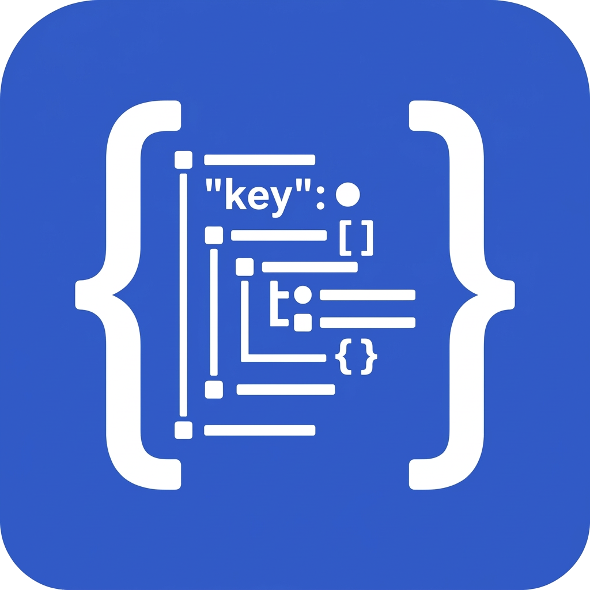
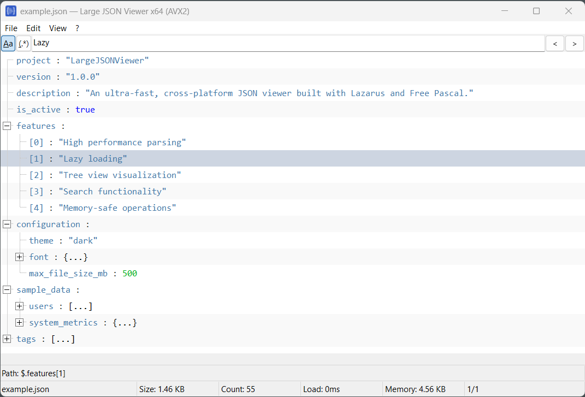

<p align="center">
  
</p>

# Large JSON Viewer

Large JSON Viewer is a Lazarus and Free Pascal desktop application for opening, exploring, searching, and exporting very large JSON files without relying on heavyweight runtime dependencies. The project is designed for native performance, predictable memory usage, and cross-platform portability across Windows, Linux, and macOS.

## Screenshot

<p align="center">
  
</p>

## Installation

This project is currently intended to be built from source.

1. Install Lazarus 4.6 or newer.
2. Install Free Pascal Compiler 3.2.2 or newer.
3. Clone or download this repository.
4. Open `LargeJSONViewer.lpi` in Lazarus, or build it with `lazbuild`.
5. Use the resulting executable from your local build output.

```bash
git clone https://github.com/muhiminulhasan/LargeJSONViewer.git
cd LargeJSONViewer
lazbuild LargeJSONViewer.lpi
```

There is no official installer at this time. Building from source is the recommended and safest way to run the project.

## Security Notice

> [!WARNING]
> This project does not currently ship with a commercial code signing certificate. Any pre-built Windows binary may trigger Microsoft Defender SmartScreen or similar operating system trust warnings because the publisher identity cannot be verified.

- Prefer building from source whenever possible.
- Download binaries only from a source you personally trust.
- Treat unsigned binaries as higher risk than signed releases because they do not provide publisher verification.
- If checksums or reproducible build instructions are published in the future, verify them before running downloaded executables.

If you intentionally choose to run a trusted unsigned Windows build:

1. Right-click the downloaded executable and open **Properties**.
2. If an **Unblock** checkbox appears, enable it and select **Apply**.
3. Launch the executable.
4. If SmartScreen appears, select **More info**.
5. Confirm the file path and source, then choose **Run anyway** only if you trust the binary.

Do not bypass SmartScreen for files from unknown, altered, or unverified sources.

## Author

**A. S. M. Muhiminul Hasan**

- Website: [muhiminulhasan.com](https://muhiminulhasan.com)

## Support

<p align="center">
  <a href="https://www.buymeacoffee.com/muhiminulhasan"></a>
</p>

## Features

- Opens large JSON files with a native Lazarus desktop interface.
- Uses memory-mapped and streaming-oriented parsing strategies for large datasets.
- Presents JSON data in a tree view with lazy expansion and on-demand node materialization.
- Supports searching across keys and values with case-sensitivity controls.
- Includes recent files, refresh handling, drag-and-drop opening, and clipboard-friendly copy actions.
- Exports JSON content and selected sections to JSON, XML, CSV, YAML, and TOML formats.

## Requirements

- Lazarus IDE 4.6 or newer
- Free Pascal Compiler 3.2.2 or newer
- Windows, Linux, or macOS
- Enough disk and memory capacity for the JSON files you plan to inspect

## Usage

1. Build and start the application.
2. Open a JSON file from the file menu, drag and drop a file into the window, or use paste/open workflows provided by the app.
3. Browse the JSON structure in the tree view.
4. Use the search bar and search mode controls to locate matching keys or values.
5. Right-click nodes for copy and export actions.
6. Use refresh when the source file changes on disk, especially during debugging or data pipeline validation.

## Building From Source

### Lazarus IDE

1. Open `LargeJSONViewer.lpi`.
2. Select the desired build mode or target platform in project options.
3. Build the project from the Lazarus menu.

### Command Line

```bash
lazbuild --build-mode=Default LargeJSONViewer.lpi
```

Additional examples:

```bash
lazbuild --build-mode=Win64 LargeJSONViewer.lpi
lazbuild --cpu=x86_64 --os=linux --ws=gtk2 LargeJSONViewer.lpi
lazbuild --cpu=aarch64 --os=darwin LargeJSONViewer.lpi
```

## Contributing

Contributions are welcome.

1. Fork the repository.
2. Create a focused feature branch.
3. Keep changes reviewable and test your build locally.
4. Submit a pull request with a clear description of the problem and solution.

For larger changes, opening an issue first is recommended so implementation details can be discussed before significant work begins.

## License

This project is licensed under the [MIT License](LICENSE).
